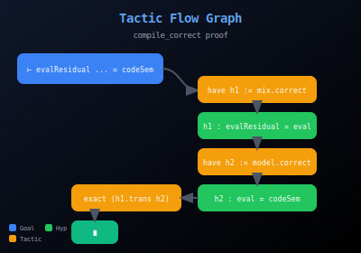
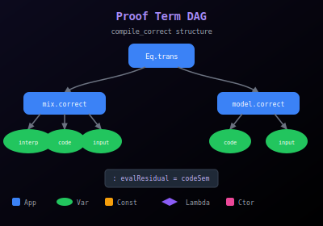

<sub><strong>Our tech stack is ontological:</strong><br>
<strong>Hardware — Physics</strong><br>
<strong>Software — Mathematics</strong><br><br>
<strong>Our engineering workflow is simple:</strong> discover, build, grow, learn & teach</sub>

---

<sub>
<strong>Notice of Proprietary Information</strong><br>
This document outlines foundational concepts and methodologies developed during internal research and development at Apoth3osis. To protect our intellectual property and adhere to client confidentiality agreements, the code, architectural details, and performance metrics presented herein may be simplified, redacted, or presented for illustrative purposes only. This paper is intended to share our conceptual approach and does not represent the full complexity, scope, or performance of our production-level systems. The complete implementation and its derivatives remain proprietary.
</sub>

---

# Futamura-Adelic: Organic Alignment Mathematical Framework

[](https://lean-lang.org/)
[](https://github.com/leanprover-community/mathlib4)
[](LICENSE)
[](reports/GREP_SORRY_ADMIT.txt)

## Credo

> *"The whole is not merely the sum of its parts, but the parts derive their meaning from the whole. Every local optimization must serve the global coherence—this is the principle of organic unity that governs both living systems and sound mathematics."*
> — **Inspired by Alfred North Whitehead, Process and Reality**

This formalization embodies the principle that alignment emerges from compositional structure. Just as cells coordinate to form organisms, and neurons coordinate to form minds, our mathematical framework demonstrates how local computations (partial evaluation, gradient descent, scale separation) compose into globally coherent systems. The Futamura projections show that understanding *how* to compile is equivalent to compiling itself; the adelic structure shows that multi-scale coherence arises from the restricted product condition. Together, they provide a rigorous foundation for "organic alignment"—the hypothesis that intelligent systems can be aligned through compositional mathematical structure rather than ad-hoc constraints.

### Acknowledgment

We humbly thank the collective intelligence of humanity for providing the technology and culture we cherish. We do our best to properly reference the authors of the works utilized herein, though we may occasionally fall short. Our formalization acts as a reciprocal validation—confirming the structural integrity of their original insights while securing the foundation upon which we build. In truth, all creative work is derivative; we stand on the shoulders of those who came before, and our contributions are simply the next link in an unbroken chain of human ingenuity.

---

**A Lean 4 formalization of the mathematical foundations for multi-scale compositional systems with gradient-based optimization—the "Organic Alignment" stack.**

<table>
<tr>
<td align="center" width="50%">
<strong>2D Proof Map</strong><br/>
<em>Click to explore: pan, zoom, search declarations</em><br/>
<a href="https://abraxas1010.github.io/futamura-adelic/artifacts/visuals/futamura_adelic_2d.html">
  
</a><br/>
<a href="https://abraxas1010.github.io/futamura-adelic/artifacts/visuals/futamura_adelic_2d.html">▶ Open Interactive 2D Map</a>
</td>
<td align="center" width="50%">
<strong>3D Proof Map</strong><br/>
<em>Click to explore: rotate, zoom, click nodes</em><br/>
<a href="https://abraxas1010.github.io/futamura-adelic/artifacts/visuals/futamura_adelic_3d.html">
  
</a><br/>
<a href="https://abraxas1010.github.io/futamura-adelic/artifacts/visuals/futamura_adelic_3d.html">▶ Open Interactive 3D Map</a>
</td>
</tr>
<tr>
<td align="center" width="50%">
<strong>Tactic Flow Graph</strong><br/>
<em>Proof tactics and goal transformations</em><br/>
<a href="https://abraxas1010.github.io/futamura-adelic/artifacts/visuals/tactic_flow.html">
  
</a><br/>
<a href="https://abraxas1010.github.io/futamura-adelic/artifacts/visuals/tactic_flow.html">▶ Open Interactive Tactic Flow</a>
</td>
<td align="center" width="50%">
<strong>Proof Term DAG</strong><br/>
<em>Abstract syntax tree of proof terms</em><br/>
<a href="https://abraxas1010.github.io/futamura-adelic/artifacts/visuals/proof_term_dag.html">
  
</a><br/>
<a href="https://abraxas1010.github.io/futamura-adelic/artifacts/visuals/proof_term_dag.html">▶ Open Interactive Proof DAG</a>
</td>
</tr>
</table>

---

## The Organic Alignment Stack

This library implements the mathematical vision behind "organic alignment"—the principle that alignment emerges from how intelligent agents cooperate, like cells forming bodies or neurons forming minds.

```
                    ORGANIC ALIGNMENT STACK
┌─────────────────────────────────────────────────────────────────┐
│  GOAL: Local optimization → Global coherence (like cells→body) │
├─────────────────────────────────────────────────────────────────┤
│                                                                 │
│  TROPICAL GEOMETRY          ← Decision boundaries, ReLU        │
│       ↓                                                         │
│  DIFFERENTIAL (Dual Numbers) ← Gradient flow, sensitivity      │
│       ↓                                                         │
│  ADELIC (Restricted Product) ← Multi-scale coherence, sparsity │
│       ↓                                                         │
│  FUTAMURA (Specialization)   ← Compilation, meta-learning      │
│       ↓                                                         │
│  SHEAF/TOPOS                 ← Local-to-global, internal logic │
│       ↓                                                         │
│  FREE ENERGY                 ← Goal-directed behavior          │
│       ↓                                                         │
│  RENORMALIZATION GROUP       ← Scale separation, emergence     │
│                                                                 │
└─────────────────────────────────────────────────────────────────┘
```

## Key Results

| Layer | Key Theorem | Mathematical Content |
|-------|-------------|---------------------|
| **Tropical** | `relu_is_tropical` | ReLU = tropical addition with 0 |
| **Differential** | `chainRule`, `S_derivative_correct` | Exact differentiation via dual numbers |
| **Adelic** | `specialization_finite_lens_activity` | Restricted product = sparsity |
| **Futamura** | `compile_correct` | First projection: mix(interp, code) = compiled |
| **Free Energy** | `freeEnergy_bounds_surprise` | F ≥ -log p(o) (Jensen's inequality) |
| **Renormalization** | `deep_rg_converges` | RG flow → fixed points |
| **Sheaf** | `sheaf_diffusion_converges` | Diffusion → harmonic sections |

## Why These Techniques Together

| Technique | Mathematical Role | ML/Alignment Application |
|-----------|-------------------|--------------------------|
| **Dual Numbers** | Exact differentiation (Leibniz rule) | Backpropagation, gradient flow |
| **Adelics** | Multi-scale coherence (restricted product) | Hierarchical representations, sparsity |
| **Futamura** | Specialization/compilation | Meta-learning, JIT, learning-to-learn |
| **Tropical** | Piecewise-linear geometry | ReLU networks, decision boundaries |
| **Free Energy** | Variational optimization | Goal-directed behavior, active inference |
| **Renormalization** | Scale separation | Layer-by-layer coarse-graining |
| **Sheaves** | Local-to-global coherence | Distributed representations |

## Module Architecture

```
HeytingLean/
├── Tropical/
│   ├── Semiring.lean          # (ℝ ∪ {-∞}, max, +) semiring
│   ├── ReLU.lean              # ReLU as tropical polynomial
│   └── Differential.lean      # Tropical-differential connection
├── ActiveInference/
│   ├── FreeEnergy.lean        # Variational free energy F
│   ├── Agent.lean             # Active inference agents
│   └── AdelicFreeEnergy.lean  # Multi-scale free energy
├── Renormalization/
│   ├── CoarseGrain.lean       # RG transformations
│   ├── Differential.lean      # Beta functions
│   └── Adelic.lean            # Coupled multi-scale RG
├── ProgramCalculus/
│   ├── Futamura.lean          # First Futamura projection
│   ├── Futamura2.lean         # Second projection (compiler-compiler)
│   ├── AdelicFutamura.lean    # Adelic-Futamura connection
│   └── AdelicOpsInstances/
│       └── SKYAdelic.lean     # Non-trivial adelic instance
├── LoF/Combinators/
│   ├── Differential/          # Dual numbers, chain rule
│   ├── Topos/
│   │   └── SheafNeuralNet.lean # Sheaf neural networks
│   └── Category/
│       └── NeuralCategory.lean # Parametric categories
└── Embeddings/
    └── Adelic.lean            # Restricted product structure
```

## Quick Start

### One-Command Verification

```bash
./scripts/verify_futamura_adelic.sh
```

This runs:
1. Strict build (`lake build --wfail`)
2. Sorry/admit grep (must be empty)
3. Demo executables
4. Hostile-environment tests
5. Portability checks

### Manual Build

```bash
lake update
lake build --wfail
```

### Run Demos

```bash
lake exe tropical_relu_demo
lake exe free_energy_demo
lake exe rg_flow_demo
lake exe sheaf_diffusion_demo
lake exe adelic_futamura_demo
lake exe organic_alignment_stack_test
```

## Theoretical Background

### Primary Sources

1. **Futamura, Y.** "Partial Evaluation of Computation Process" (1971, 1999)
2. **Ehrhard, T. & Regnier, L.** "The Differential Lambda-Calculus" (2003)
3. **Friston, K.** "The Free Energy Principle" (Nature Rev Neurosci, 2010)
4. **Zhang et al.** "Tropical Geometry of Deep Neural Networks" (ICML 2018)
5. **Mehta & Schwab** "An Exact Mapping between VRG and Deep Learning" (2014)
6. **Hansen & Ghrist** "Toward a Spectral Theory of Cellular Sheaves" (2019)
7. **Gavranović et al.** "Categorical Deep Learning" (ICML 2024)

### Organic Alignment Vision

- **Shear, E. et al.** "Organic Alignment" (Softmax, 2025)
- **Levin, M.** "Collective Intelligence" (Nature Comms Bio, 2024)

## License

This project is provided under the Apoth3osis License Stack v1.
See `LICENSE.md` and the files under `licenses/`.
